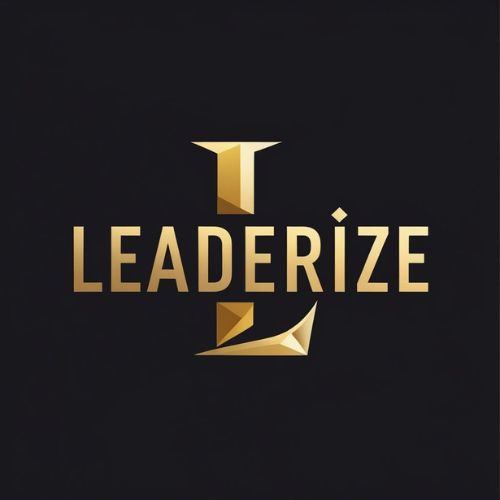

<div align="center">
  
  <h1>🚀 Leaderize Resources</h1>
  <p><i>Strategic AI resources and executive playbooks designed for modern leaders.</i></p>
</div>

---

### 📂 Repository Structure
A map of the assets available in this repository:

```text
Leaderize-Resources/
├── resources/           # Main guides and playbooks
│   └── executive-rag-playbook.pdf
├── documents/           # Legal and protocol docs
└── README.md            # Dashboard and navigation
```
### 🛠️ Quick Access Resource Table

| Resource Name | Type | Description |
| :--- | :--- | :--- |
| [🚀 Executive RAG Playbook](./executive-rag-playbook.pdf) | 📕 PDF | Strategic guide for implementing RAG architectures. |
| [🤖 Claude Setup Playbook](./Leaderize%20-Claude-Setup-Playbook_1.pdf) | 📕 PDF | Step-by-step framework for leadership AI configuration. |
| [🧠 Prompting Frameworks](./Docs:AI-Prompting-Frameworks-for-Leaders...) | 📕 PDF | Essential prompting structures for executive workflows. |
